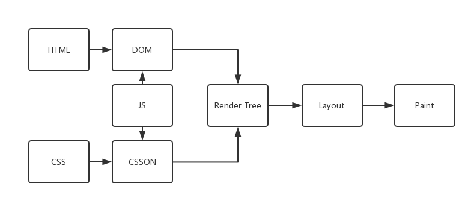

- ###  inline & inline-block & block
     ```html
        <div style="width: 400px;height: 200px">
            <span style="float: left;width:auto;height:100%">
                <i style="position: absolute;float: left;width:100px;height: 5px">
                    hello
                </i>
            </span>
        </div>
     ```
    + 题目: 上面代码中 span 标签的 width 和 height 是多少       
    + 解答: 
        * `span` 标签和 `i` 标签本身是内联标签，所以没有 `height` `width` 属性，同时内联元素的垂直方向的 `padding`, `margin` 都无效，水平方向的有效
        * 添加 `float` 属性或者属性 `position: absolute` 之后，元素就变成块级元素，块级元素有属性 `width`,`height`
        * 而 `span` 元素是 `i` 元素的父元素，所以它的 `width` 被子元素挤开,也就是等于子元素的宽度，而高度为 `100%`，就是其父元素的高度
    + [示例](inline&inline-block&block.html)

---
- ###  表示高亮的 html 标签

    + 题目: 假设一个搜索结果展示页面，需要吧搜索关键字高亮显示，应该使用哪个标签      
    + 解答: `<mark>`
    
---
- ###  图像格式
    + 题目: 嵌入HTML文档中的图像格式可以是什么？     
    + 解答: `git`, `bmp`, `jpg`。 不支持`tif( tagged image file format)`

---
- ### html5标签的意义
    + 以下说法正确的是
        * `<kbd>` 来表示用户输入
        * `<var>` 用来表示变量
        * `list-inline` 查看源码看到该类只设置了两个属性
        ```css
            .list-inline{padding-left:0;list-style:none}
        ```
        * `<code>` 表示代码片段
    + 解答:
        * ABCD 都对
        * `<kbd>` 表示键盘键入
        * `<var>` 用来表示变量的名称，常用 `<code>` 与 `<pre>` 标签一起使用
        * `list-inline` 是`bootstrap`的排版类
        * [示例](html5tag.html)

---
- ### javascript 写在 HTML 代码中的哪一部分，会导致页面在加载的时候自身被执行
    + [示例](js加载问题.html)
    + 在实验中无论js是写在`head`还是`body`， 都能被执行， 只是执行的时间不同。 一个是在页面加载前，一个是在页面加载的时候。  
    但是有说法就是： *`head`标签中是用于一些静态资源的预加载，与解析没有任何关系。浏览器会先加载head标签内的静态资源(css,js)，这个时候js并没有执行，而是被UI线程阻塞了，然后浏览器会开始构建DOM Tree，然后开始构建CSSOM Tree(就是题目说的加载页面)，最后才执行head中加载的js。*
    但是，如果 Dom Tree在执行`head`里js前被构建好，那在js应该是可以获取 dom 节点的，但是却获取不到。
    + 对于浏览器解析页面的过程
        * 参考:
            - [阮一峰:网页性能管理详解](http://www.ruanyifeng.com/blog/2015/09/web-page-performance-in-depth.html)
            - [web页面加载、解析、渲染过程](https://www.cnblogs.com/CandyManPing/p/6635008.html)
            - [网页解析的全过程(输入url到展示页面)](https://www.cnblogs.com/wpshan/p/6282061.html)         
            - [HTML页面加载和解析流程](https://blog.csdn.net/qq_39793127/article/details/78900707)
        * 总结一下
            - 概念
                + 重排
                    由于页面布局发生改变，重新计算 **Render Tree**。(影响性能)  原因为
                    * 页面初始化
                    * 操作DOM
                    * 某些元素的尺寸改变
                    * CSS属性发生改变
                    减少
                    * 不要一条一条修改DOM的样式，预先定义好CSS的`classname`，修改DOM的`classname`
                    * 不要把DOM节点的属性值放在一个循环里当成循环的变量
                    * 为动画脱离文档流
                    * 不要使用table布局
                + 重绘
                    只改变某个元素的样式，并且不影响布局(如背景颜色),浏览器重新绘制改元素
            - 浏览器的组成部分
                + 用户界面:与用户交互的地方(除了主窗口)
                + 浏览器引擎:用来查询和操作渲染引擎的接口
                + 渲染引擎:用来解析显示页面的
                + UI后端:用来绘制各种组件(选择框等等)
                + 网络:用来完成网络调用，接口与平台无关
                + js解释器:解析执行js代码
                + 数据存储:web database，客户端存储技术
            - 页面生成过程
                + 一个页面在呈现时，所要进行的流程
                  
                **强调一点,浏览器解析页面的时候是自上而下的。**所以从上面的图可以知道当浏览器拿到一张页面的时候，就会进行如下的操作：
                    * 开始加载HTML标签，生成Dom Tree
                    * 遇到CSS文件，向服务器请求CSS文件，得到后开始生产CSSON Tree(异步)
                    * 如果此时遇到JS文件，会立刻请求该文件，同时停止生产DOM Tree和CSSON Tree，即JS阻塞页面。因为js文件中可以操作DOM，从而使得DOM结构改变，从而导致整个 Render Tree 要重新计算。所以在有js文件的时候需要请求完成，并且执行完成才能继续进行下一步。
                    * 当DOM Tree与CSSON Tree构建完成，就将其组合成Render Tree。Render Tree并不等同于Dom Tree，比如 `display:none`的元素就不在Render Tree上。
                    * 当Render Tree绘制完成就是Layout render tree。计算每个节点在屏幕中的位置
                    * 最后是使用UI后端层遍历绘制每个节点

---
- ### DTD
- 解释: 文档类型定义( Document Type Definition )， 为了进行程序见的数据交换而建立的关于标记符的语法规则。比如 
    ```
        <?xmlversion="1.0"?>
        <!DOCTYPE note [
        <!ELEMENT note (to,from,heading,body)>
        <!ELEMENT to (#PCDATA)>
        <!ELEMENT from (#PCDATA)>
        <!ELEMENT heading (#PCDATA)>
        <!ELEMENT body (#PCDATA)>
        ]>
        <note>
        <to>Tove</to>
        <from>Jani</from>
        <heading>Reminder</heading>
        <body>Don't forget me this weekend</body>
        </note>
    ```
就是以标签的形式表达内容( 如XML和HTML )。其包括元素、属性、实体(如`&ensp;`)、PCDATA( parsed character data，标签开始和标签结束之间的文本)、CDATA(character data，不会被解析的文本)。

---
- ### Doctype
    + 题目: 关于HTML的Doctype和严格模式与混杂模式
    + 解答: [参考](https://www.cnblogs.com/wuqiutong/p/5986191.html)  
            `<!Doctype>`的声明是文件类型定义(DTD)。声明的作用时告诉浏览器该文件是什么类型的，应该使用哪一种规范来解析该文档。其并不是一个HTML标签。
    + 严格模式和混杂模式(HTML5没有该模式的区别)
        * 严格模式： 使用W3C标准来解析代码
        * 混杂模式： 使用浏览器自己的标准来解析代码
        * 来源： 与浏览器的发展历史相关
        * 模式不同的区别：解析文档时会有差异，比如(盒模型的定义，padding，line-height，margin，width，height等等属性在解析的过程中会发生不一致的效果)

---
- ### 各种浏览器内核
    + IE (Trident) -ms
    + Edge (Edge)
    + firefox (Gecko) -moz
    + google (Webkit->Blink) -webkit
    + opera  (Presto->Webkit->Blink) -o
    + safari (Webkit) -webkit

---
- ### enctype属性
    + 作用： 该属性规定在发送到服务器之前应该如何对表单数据进行编码
    + `application/x-www-form-urlencoded` 在发送前编码所有字符(默认)
    + `multipart/form-data` 不对字符编码，在使用包含文件上传空间的表单时候，必须使用该值，上传二进制数据过去
    + `text/plain` 空格转换为'+'加号，但不对特殊字符编码

---
- ### http协议
    + 参考: 
        * [阮一峰http协议入门](http://www.ruanyifeng.com/blog/2016/08/http.html)
        * [关于HTTP协议，一篇就够了](http://www.cnblogs.com/ranyonsue/p/5984001.html)
        * [互联网协议](http://www.ruanyifeng.com/blog/2012/05/internet_protocol_suite_part_i.html)
    + HTTP发展史
        * HTTP/0.9
            - request
                + 命令：GET
            ```
                GET/index.html
            ```
            - response 只能回应HTML格式的 **字符串**,发送完毕就关闭TCP连接
            ```html
                <!DOCTYPE html>
                <html lang="en">
                <head>
                    <meta charset="UTF-8">
                    <title>Document</title>
                </head>
                <body>
                  index  
                </body>
                </html>
            ```
        * HTTP/1.0
            - request
                + 命令：GET,POST,HEAD
                + 内容：任何格式的内容
                + 头信息：描述一些元数据
            ```
                <!-- 请求命令/HTTP/HTTP版本号 --!>
                GET/HTTP/1.0

                User-Agent:Mozilla/5.0(Macintosh; Intel Mac OS X 10_10_5)

                <!-- 允许接受的数据格式 一级类型/二级类型 --!>
                Accept:*/*
                
                <!-- 允许接受的压缩方法 --!>
                Accept-Encoding
            ```
            - response
            ```
                <!-- HTTP/HTTP版本号 状态码 状态描述 --!>
                HTTP/1.0 200 ok
               
                <!-- 数据格式,头信息必须是 ASCII 码,后面的数据可以是任何格式 --!>
                <!-- 可以在分号后面接编码格式 --!>
                <!-- 根据客户端请求的时候发送的 Accept 所描述的可以接受的数据格式 --!>
                Content-Type: text/plain; charset=utf-8

                <!-- 由于发送的数据可以是任何格式，因此可以把数据压缩后再发送。Content-Encoding字段说明数据的压缩方法 --!>
                Content-Encoding: gzip
                Content-Encoding: compress 
                Content-Encoding: deflate
            ```
            - 缺点
                主要的缺点在HTTP1.0只能发送一个请求，发送数据完毕就关闭，如果还有其他资源要请求，就必须重新建立链接，但是建立TCP链接的成本是很高的，所以为了解决这个问题有些浏览器在请求的时候用了一个非标准的 `Connection` 字段。
                `Connection: keep-alive`  
                客户端发送这个字段，服务器同样回应这个字段
        * HTTP/1.1
            - 对比与HTTP/1.0
                + 持久链接
                    客户端在最后一个请求的时候，发送`Connection: close`，明确要求服务器关闭连接。对于同一个域名大多数浏览器运行建立最多6个持久连接
                + 管道机制 可以同时发送多个请求，服务器安装顺序回应
                + 增加 `Content-Length` 字段  
                    区分数据包是属于哪一个回应的
                + 分块传输编码
                    请求头或者回应头有 `Transfer-Encoding: chunked`，表明使用分块传输编码，回应将由数量未定的数据块组成
                + 命令：GET,POST,HEAD,PUT,PATCH,OPTIONS,DELETE
                + `HOST`字段 将请求发往同一个服务器的不同网站
                + 缺点 队头堵塞
                    - 减少HTTP请求
                        + 合并脚本，样式
                        + CSS SPITE
                    - 增加持久连接
                        + 域名分片
        * HTTP/2

---
- ### RESTful
    + 参考
        * [RESTful API 设计指南](http://www.ruanyifeng.com/blog/2014/05/restful_api.html)
        * [REST，以及RESTful的讲解](https://blog.csdn.net/qq_21383435/article/details/80032375)


