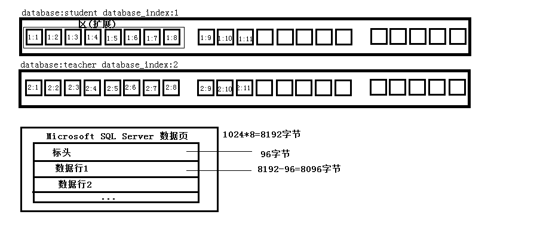
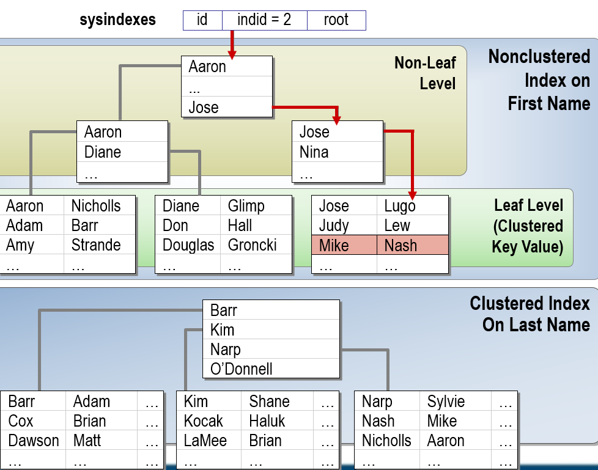
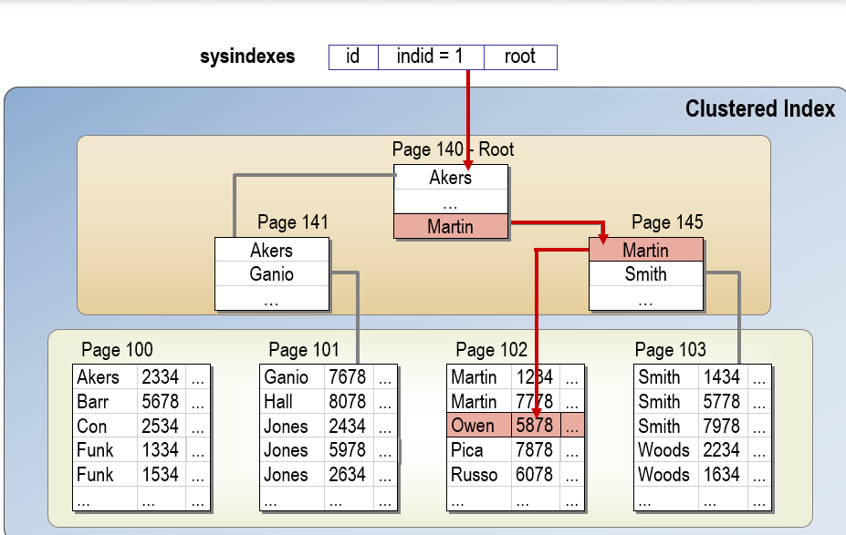

1. ### 实现数据完整性
    - #### 数据完整性类型和实现方法
        + 域完整性(列完整性) 列中的取值必须满足一定的要求，就是列完整性
            * DEFAULT(默认值约束)
            * CHECK(检查约束)
            * FOREIGN KEY(外键约束)
        + 实体完整性(行完整性) 行与行之间必须能够区别开来，也就是不可以出现完全一样的行(可以通过加标识解决)，就是行完整性
            * PRIMARY KEY(主键约束)
            * UNIQUE(唯一值约束)
        + 参照完整性(表内或表间的列参照) 一个表中的某一列的值的取值范围取决于其他表中某一列的值，或者自身所在表中的其他列。(比如成绩表中的id取决于学生表中的id，因为有学生才能有成绩)这就是参照完整性
            * FOREIGN KEY(外键约束)
    - #### 使用主键实现实体完整性
        + 主键约束和唯一值约束的区别在于唯一值约束允许值为空(只有一个值)，主键约束要求必须有值，不允许为空
        + 添加主键
        ```sql
            -- 改变数据库
            alter table student
            add
            -- 添加主键
            constraint PK_StudentID
            -- 以clustered的方式记录存放
            primary key clustered (StudentID)

            -- 删除主键命令
            ALTER TABLE [tbalename] DROP CONSTRAINT [PK_StudentID]
        ```
    - #### 创建唯一性约束实现实体完整
        + 给某列添加唯一约束，允许为空，只允许一条记录为空
        ```sql
            alter table TStudent
            add
            constraint U_cardID
            unique nonclustered (cardID)


            -- 删除唯一约束
            ALTER TABLE tablename DROP CONSTRAINT [U_cardID]
        ```
    - #### 设置自增列作为主键  
        当设置某个列为自增列的时候，会存在一个属性 `IDENTITY_INSERT`，该属性的值如果为 `OFF` 就不可以人为的插入值，设置为`ON`就可以人为的插入值了，但是以后的每次都得插入值。`SET IDENTITY_INSERT [tablename] ON`
    - #### ckeck约束规定列取值
        + 使用场景
            * 某个列的值的取值范围在0-300
            * 邮箱必须有@
            * 出生日期在某个区间
            * 性别只能输入男和女
        + 语法
            ```sql
                -- 检测已有的和以后的
                ALTER TABLE [tablename] WITH CHECK
                ADD
                CONSTRAINT [CK_mark]
                CHECK (([columnname] > 0) AND ([columnname] < 300))

                -- 只检测以后的，忽略现有的
                ALTER TABLE [tablename] WITH NOCHECK
                ADD
                CONSTRAINT [CK_mark]
                CHECK (([columnname] > 0) AND ([columnname] < 300))

                -- 其他例子CHECK的约束条件其实就是WHERE怎么写
                ALTER TABLE [tablename] WITH CHECK
                ADD
                CONSTRAINT [CK_email]
                CHECK (email like "%@%.%")

            ```
    - #### 列默认值约束
        + 设置默认值
        ```sql
            ALTER TABLE tablename
            ADD
            CONSTRAINT [DF_column_name]
            default [value] for [column_name]
        ```
    - #### 列参照完整性
        + 使用外键关系，两个相关联的字段格式要一致。
        + 外键关系其他的设置
            * 删除规则
                - 无操作
                - 层叠 主键被删除外键也会连带着被删除
            * 更新规则
                - 无操作
                - 层叠 主键被更新外键也会连带着被更新
        ```sql
            ALTER TABLE [tablename] WITH CHECK 
            ADD
            CONSTRAINT [FK_column_name] 
            FOREIGN KEY ([StudentID])
            PEFERENCES [other_tablename] ([StudentID])
            ON UPDATE CASCADE
            ON DELETE CASCADE
        ```
    - #### 使用数据库关系图查看和实体
    - #### 使约束失效
        + 唯一约束和主键约束不能失效，Check约束、默认值约束、外键约束可以失效
        + 失效方式
            * 添加约束阶段：对现有的数据不约束
                ```sql
                    ALTER TABLE 
                        table_name
                    WITH NOCHECK 
                    ADD CONSTRAINT [CK_column_name]
                    CHECK ( [condition] or [condition] )
                ```
            * 添加新的约束时，使约束失败
                ```sql
                    ALTER TABLE 
                        table_name
                    WITH NOCHECK 
                    CONSTRAINT [CK_column_name]
                ```
            * 恢复约束
                ```sql
                    ALTER TABLE 
                        table_name
                    WITH CHECK 
                    CONSTRAINT [CK_column_name]
                ```
2. ### 介绍数据库存储和索引
    - #### 数据库如何存储数据
        + 查看数据库文件编号   
            在数据库中，sqlServer会对每一个databese赋予一个编号，可以使用 `sp_helpdb database_name`查看
        + 数据库存储结构
            在数据库中，存储数据分为表->区->数据页；其中每数据页的容量为8K(8*1024字节)，其中数据页的结构为标头(必须有，包含该页的一些信息，大小为96字节)；其他就是数据行。
            
            
    - #### 根据表记录数量估算占用磁盘空间  
        学生表一行118字节(id char(10),name char(10),sex char(2),cardid char(20),birthday datetime,Email char(40),class char(20),enterTime datetime)；一页能存86条数据( 8096/118 = 86 )，2W条记录占用 295 页；。2W条记录一共占 295 * 8k = 2360k 大小。

    - #### 查看数据库的页
        ```sql
            SELECT 
                OBJECT_NAME(i.object_id) AS [tablename],
                data_pages AS [dataPage] 
            FROM 
                sys.indexes as i
            JOIN
                sys.partitions as p
                ON 
                p.object_id = i.object_id and p.index_id = i.index_id
            JOIN
                sys.allocation_units as a
                ON
                a.container_id = p.partition_id
            WHERE 
                i.object_id = OBJECT_ID('TStudent')

            --- 查看页的头信息

            dbcc traceaon
            dbcc Page([tablename],1[第几页],51,1)
        ```
    - #### 数据库如何为标分配磁盘空间
        + #### 在堆中存放数据和查找数据
            * 表中记录没有顺序要求，数据就会存放在堆中(表中哪里有空位就往哪里放)
            * IAM索引分别映像页记录的是每个页中各个分区的使用情况，如果已被使用则用1标识，反之则用0标识，该IAM页可以支持4G的空间，如果IAM表满了，则会指向另外一个IAM表
            * 在堆中查找数据只能进行全表搜索
            ```sql
                SELECT
                    *
                FROM
                    sys.indexes 
                WHERE 
                (
                    SELECT object_id from sys.all_object where name = "TStudent"
                )
            ```
        + #### 聚集索引和非聚集索引
            * 聚集索引:反映数据存储的物理顺序(汉语词典中的拼音首字母索引) indid = 1
            * 非聚集索引:不反映数据存储的物理顺序(汉语词典中的部首索引) indid != 0或者1
        + #### 使用非聚集索引在堆中查找数据  
              
            如上图，要在堆中加快查找速度，可以建立索引，然后建立索引区间，这样可以加块搜索到一条数据在堆中的位置，但是这是以消耗内存为代价的。
        + #### 使用聚集索引数据查找和页分裂
              
            如上图，聚集索引在存放的时候可能会产生分页的情况。也就是说如果后面插入的多条数据在插入的时候页放不下了，就会放到所有页的最后面，但是会在该插入的地方指明这页的下一页是最后面的一页。

3. ### 创建和维护索引