# 第一章 git入门

   - ## Git工具分类
      - ### 命令行  
         bash、cmd、power shell等（bash是linux的命令行）
      - ### GUI  
         GIT GUI、Github Desktop等
      - ### IDE集成  
         visual studio、Eclipse、intellij IDE

   - ## Git安装
   
      - ### Git安装完成后会出现三个快捷方式。  
         - Git Bash
         - Git CMD
         - Git GUI

      - ### 安装完成后进入Git Bash，设置其环境：
         - 光标颜色  
           默认：白色   --》 绿色
         - 光标形状  
           默认：下划线 --》 块状
         - 光标闪烁  
           默认：闪烁   --》 不闪
         - 字体大小  
           默认：9号    --》 14号

      - ### Bash的简单命令
         - #change directory --》 `cd`
         - #make directory --》 `mkdir`
         - #print working directory --》 `pwd`
         - #move --》 `mv`
         - #copy --》 `cp`
         - #remove --》 `rm`
         - #scan file --》 `cat filename`
         - #print --》 `echo`

      - ### 设置Git参数
         - `git config --list`  
            显示当前的 Git 配置
         - `git config --global user.name "NAME"`  
            设置提交仓库时的用户名信息
         - `git config --global user.email "EMAIL"`  
            设置提交仓库时的邮箱信息

      配置好的信息是在一个文件夹中存储着的，在主目录中，使用 cd ~ 命令回到主目录；ls -a 查看文件夹中的所有文件（-a代表包括隐藏文件）；配置信息存储       在.gitconfig文件中。输入 vim .gitconfig 可以编辑此文件。

   - ## Git Bash操作的4个坑
      - ### 命令行换行  
         - \ 反斜杠是换行符（将命令视为一行）  
      - ### 命令行终结  
         - `Ctrl + C` 强制退出  
      - ### 显示了一些信息  
         - `git log`
      - ### 命令行翻页和退出  
         - g        --> 向下走一行  
         - k        --> 向上走一行  
         - gg       --> 最顶端  
         - G        --> 最底端  
         - /搜索内容 --> 查找搜索内容  
         - n        --> 查看下一个匹配的   
         - u        --> 查看上一个匹配的   
         - q        --> 退出   
      - ### vim的模式操作 
        - i   --> 编辑模式  
        - ESC --> 普通模式  
        - :   --> 命令模式  
 

   - ## Git操作
      - ### git的工作流程  
         git分为工作区 --add--》 暂存区 --commit--》 仓库区。    
         当文件提交至仓库区，文件当前的版本即被存档，于是，多次的提交就会产生历史提交记录。根据历史提交记录，文件可以回退到任意一个历史记录的版本。  
      - ### git bash 命令分类（本地）
         - #### 新建代码仓库
            - `git init`  
               在当前目录新建一个Git代码库
            - `git clone [url]`  
               下载一个项目和它的整个代码历史
         - #### 添加删除文件
            - `git add [file1] [file2]`  
               添加指定文件到<font color=#00ffff>暂存区</font>
            - `git rm [file1] [file2]`  
               删除<font color=#00ffff>工作区</font>文件，并且将这次删除放入暂存区
            - `git mv [file-origin] [file-renamed]`  
               改名文件，并且将这个改名放入<font color=#00ffff>暂存区</font>
         - #### 代码提交
            - `git commit -m [message`]  
               提交暂存区到仓库
            - `git commit -a -m [message]`  
               直接从工作区提交到仓库，前提该文件已经有仓库中的历史版本
         - #### 查看信息类
            - `git status`  
               显示变更信息
            - `git log` / `git log --oneline`   
               显示当前分支的历史版本
            - `git log --pretty=format:'%h %ad | %s%d [%an]' --graph --date=short`  
               以 哈希值 时间 | 备注 \[提交人\] 的方式显示历史记录
            - `git show [hash of file]`  
               查看一个文件
            - `git config --list`   
               查看配置信息
         - #### 同步远程仓库
            - `git remote add [shortname] [url]`  
               增加远程仓库，并命名
            - `git push [remote] [branch]`  
               将本地的提交推送到远程仓库
            - `git pull [remote] [branch]`  
               将远程仓库的提交拉下到本地
            - `git remote -v`  
               查看是否和其他仓库建立连接
            - `git clone [url]`  
               克隆远程仓库里的东西到本地
         - #### git练习地址
            - https://try.github.io
            - 使用nodeJS安装Git-it  
               命令： `npm install git-it -g`;

---

# 第二章 Git进阶

   - ## git的四个区，5个状态  
      可参考 [一张图看明白Git的四个区五种状态](https://geektutu.com/post/git-four-areas-five-states.html)
      - ### 四个区
         - 工作区 working area
         - 暂存区 stage
         - 本地仓库 local Repository
         - 远程仓库 remote repository

      - ### 五个状态
         - 未修改 origin
         - 已修改 modified & 未追踪 untracked
         - 已暂存 staged
         - 已提交 committed
         - 已推送 Pushed

   - ## git 图形界面工具
      - ### GIT GUI  
         启动方式：
         - 点击 Git GUI 图标   
         - 在 Git Bash 中输入 `gitk`  
         打开界面，选择一个仓库进入，得到下图 
         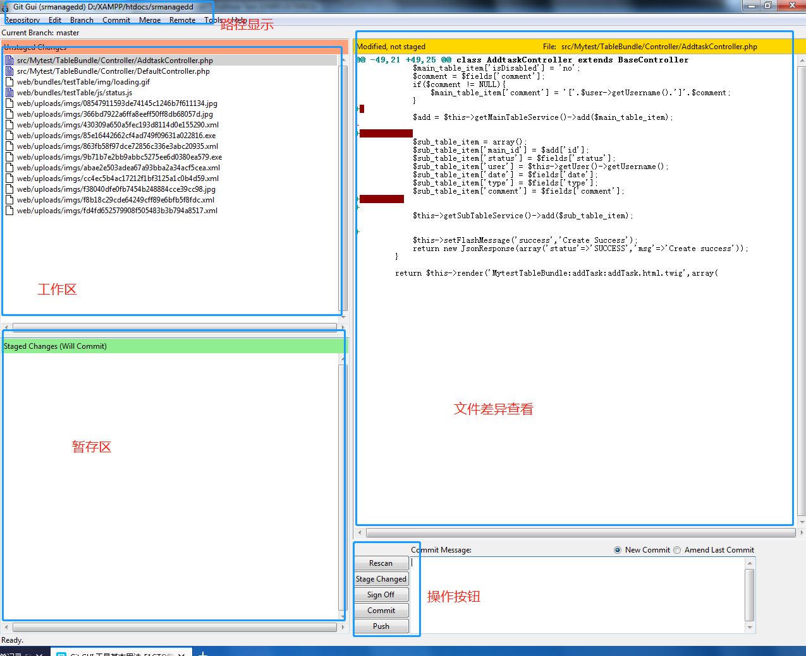

         图中操作按钮含义如下：
         - Rescan 重新扫描，即刷新
         - Stage Changed 将工作区的文件提交到暂存区，即git add
         - Sign Off 提交到仓库时所带的备注
         - Commit 将暂存区的文件提交到仓库
         - Push 提交到远程仓库

      - ### SOURCE TREE  
         这是一个开源的，轻量的，免费的GUI工具。 [sourcetree](https://www.sourcetreeapp.com/)。    
         点击文件状态就可以查看工作区和暂存区，以及相关操作。点击日志/历史可是查看git log。

      - ### EGit  
         EGit 是 HBuilder 或者 IDE Eclisp 的一个插件。

   - ## Git配置
      - ### gitignore       
         - 格式：纯文本    
           在git仓库里放一个`.gitignore`文件，告诉git每次在git staged的时候，把.gitignore下的所包含的文件忽略。  
         - 使用场合
            + 忽略操作系统自动生成的文件，比如：缩略图等；
            + 忽略编译生成的中间问价、可执行文件等，比如：c语言编译产生的 .obj 文件和 .exe 文件。
            + 忽略带有敏感信息的配置文件，比如：存放口令的配置文件
            + tmp/ 临时目录。
            + log/ 日志目录。
         - 书写格式  
            每一个文件(如1.html)或者每一类文件(如 *.obj )以行隔开；   
            添加的注释以 # 开头；  
            [官方模板地址](https://github.com/github/gitignore)；
         - `git check-ignore -v [filename]`  
            查看 gitignore 具体内容命令

      - ### 换行
         + CR  
            carriage return 回车，光标到首行， '\r' = return
         + LF
            line feed 换行，光标下移一行，'\n' = newline
            - \n   --> linux  换行
            - \r\n --> window 换行
            - \r   --> MAX OS 换行
         + 配置
            * `git config --global core.autocrlf true`  
               提交时转换为LF，检出时转换为CRLF，默认设置不用修改，Git是Linux配置
            * `git config --global core.safecrlf false`  
               允许提交包含混合换行符的文件

      - ### 别名
         + `git config --global alias.别名 要代替的命令`  
            设置别名，`git config --global alias.ci commit`；
         + 别名的设置同样存储在.gitconfig文件中，可以通过上面的命令行添加别名，也可以通过直接修改 .gitconfig 来添加修改别名；  
            ;
            
      - ### 凭证  
         关于每次push都要输入凭证的解决办法  
         + `git config --global credential.helper wincred`  
            存储凭证；如果是使用http协议来操作远程仓库的话，可以让wincred这个小的工具来帮助管理credential，wincred会把第一次push的用户名和密码存起来，当我们下一次再push，便不会再提示输入密码了。
         + 使用ssh协议，不使用http协议。

   - ## Git协议
      + ### 本地协议
         *  `git clone 本地url(如/c/wd/test.git)`  
            克隆本地仓库
         *  `git clone file:///c/wd/test.git`  
            克隆本地仓库，不建议使用 file:// 协议，因为使用file协议，每次push或者merge或者clone等等的操作都要经过file协议栈来做文件的传输，显然没有直接文件系统操作的效率高。
         *  `git remote add origin /c/wd/test.git`  
            添加远程仓库的链接
            +  `git remote -v`
               查看远程仓库链接
      + ### Git协议  
         Git协议没有授权，也就是说，使用git协议，要不就是完全可以访问，要不就是完全访问不了。  同时要求防火墙开9418端口，9418端口并不是一个标准的端口(如80端口)。
         * `git clone git://server_ip/test.git`  
            克隆远程仓库
         * `git remote add origin git://server_ip/test.git`  
            添加远程仓库的链接
      + ### HTTP协议  
         http协议运行的端口号一般是80端口，而https一般运行的端口号是443。可以利用第三方工具来存储用户密码。
         * `git clone https://github.com/wangding/test.git`  
            克隆远程仓库
         * `git clone https://github.com/wangding/test.git`  
            添加远程仓库的链接
      + ### SSH协议(Secure Shell)  
         ssh协议是一个授权的网络协议，它需要一对密钥对(公钥和私钥)。ssh协议对传输文件的压缩是最大的在四个协议中。使用ssh协议的流程：
         1. `ssh-Keygen -t rsa -C "your email"`  
            生成RSA密钥对，RSA是密钥的形式(密钥的算法)；
         2. 在Github网站添加公钥  
            在登录状态下,单击头像的下拉菜单，点击 settting；选择 SSH and GPG keys；添加新的 SSH，将上一步的公钥输入进去。
         3. 使用SSH协议，克隆仓库或者添加远程连接
            - `git clone ssh://git@github.com/wangding/test.git` / `git clone git@github.com:wangding/test.git`  
               克隆远程仓库，一般写成简短的命令
            - `git remote add origin git@github.com:wangding/test.git`  
               添加远程仓库的链接

   - ## Git基本操作

      + ### 几个Git新命令
         *  `git`  
            git命令信息
         *  `git help -a`  
            查看全部git子命令
         *  `git blame <file name>`  
            逐行查看文件的修改历史
         *  `git blame -L 100,10 <file name>`  
            从第100行开始，到110行。逐行查看文件的修改历史。
         * `git clean -n`  
            列出打算清除的档案
         * `git clean -f`  
            真正的删除
         * `git clean -x`  
            连.gitignore中忽略的档案也删除
         * `git status -sb`  
            简短的显示工作区状态，s->short b->bratch

      + ### git add 深入讲解  
         
         注意查看git status状态时，显示的颜色。红色代表在工作区，绿色代表在暂存区。

         * `touch <filename>`  
            添加新文件
         * `git rm <filename>` / `rm <filename>`(bash 命令)  
            删除文件
         * `vim <filename>` / `echo >>> <content>`    
            编辑文件(增加内容、删除内容、修改内容)
         * `git mv <original filename(url)> <new filename(url)>`  
            文件改名
         * `git mv <original filename(url)> <new filename(url)>`    
            文件移动
         * `mkdir <filename>`    
            文件夹的操作(添加，删除，改名，移动)
         * `git add -p <filename>`    
            一个文件多次提交，即将一个文件的多处修改分次提交，会弹出提示
            `Stage this hunk[y,n,q,a,d,/,s,e,?]?`,其中
            - y --> yes 整块暂存
            - n --> no  不暂存
            - q --> q   退出
            - a -->
            - d -->
            - / -->
            - s --> split 分割
            - e --> edit 手工编辑块
         * `git diff [<filename>]`      
            查看工作区和暂存区的Diffrent
         * `git diff --cached [<filename>]`  
            查看暂存区与commit的版本的差异
      + ### git commit 深入讲解  
         - 每个提交要保证适当的颗粒的、相关性和独立性。
            1. 以一个小功能，小改进或一个 bug fix 为单位
            2. 对应的 unit test 程序在同一个commit
            3. 无相关的修改不在同一个commit
            4. 语法错误的半成品程序不能commit

         - commit Message 书写规范  
            下面是Angular Commit 书写规范  

            ```html
            <type>( <scope> ): <subject>
            <!-- type 修改的类型 -->
            <!-- scope 影响的范围 -->
            <!-- subject 提交的目的 -->
            <!-- 空一行 -->
            <body>
            <!-- 空一行 -->
            <footer>
            <!-- footer 里可以写 close #num 来关闭 issues中的bug号 -->
            ```
            
         - type的常见类型
         [Commit message 和 Change log 编写指南](http://www.ruanyifeng.com/blog/2016/01/commit_message_change_log.html)
            1. feat  新功能( feature )
            2. fix   修补bug
            3. docs  文档( documentation)
            4. style 格式( 不影响代码运行的变动 )
            5. refactor 重构( 即不是新增功能，也不是修改bug的代码变动 )
            6. test 增加测试
            7. chore 构建过程或辅助工具的变动

      + ### 查看信息深入讲解
         * `git shatus -sb`  
            查看简短的信息
         * `git show <hash>` / `git show HEAD`  
            查看某个提交信息,在 HEAD 后加上 ` ~number `代表寻找HEAD钱number个记录
         * `git log <filename>` / `git log --grep <msg>` / `git log -n`   
            查看提交历史, `--grep` 代表过滤操作, `<msg>` 表示要选择的内容。
         * `git diff`  
             
         * `git tag nickname <提交版本>`  
            比如 `git tag abc HEAD~4` , 讲一个名为abc的指针指向HEAD前4的位置 

            
      + ### 回撤操作深入讲解
         * `git reset HEAD`  
            回撤暂存区内容到工作目录(保留工作区的内容)
         * `git checkout -- files`  
            回撤暂存区内容到工作目录(不保留工作区的内容)
         * `git reset HEAD --soft`  
            回撤提交到暂存区
         * `git reset HEAD -hard`  
            回撤提交，放弃变更
         * `git push -f`  
            回撤远程仓库, -f 即 --force  

          

         * `git commit --amend -m <msg>`  
            回撤上一次提交
         * `git rebase -i HEAD~3`  
            变基操作，改写历史提交，比如合并历史，更改历史提交的message，拆分历史(提交了3个版本拆分成5个版本)

      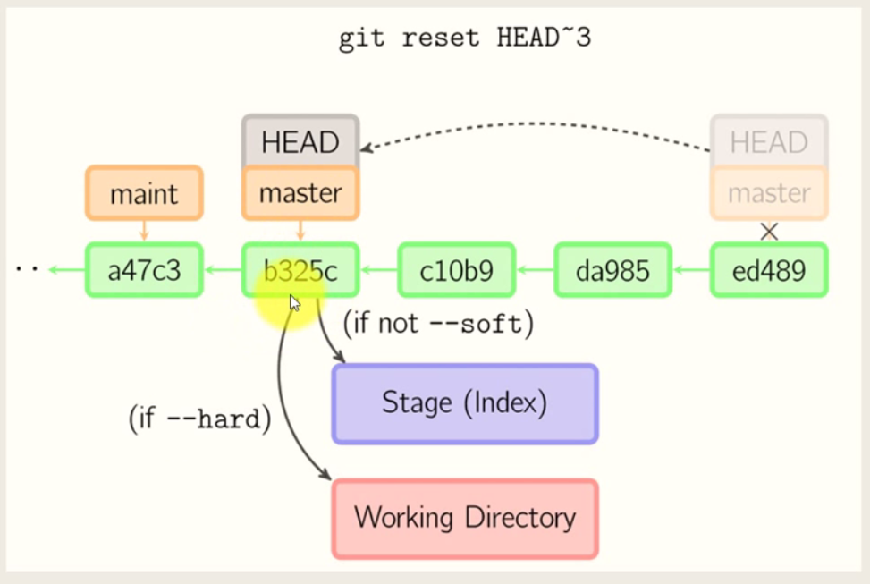 

   - ## 标签操作
      + `git tag foo`  
         在当前提交上，打标签foo
      + `git tag foo -m "message"`    
         在当前提交上，打标签foo，并给message信息注释
      + `git tag foo HEAD~4`    
         在当前提交之前的第四个版本上，打标签foo
      + `git tag`  
         列出所有标签
      + `git tag -d <tagName>`  
         删除标签
      + `git push origin --tags` / `git push origin v0.1`  
         把标签推到远程仓库
      + `git pull --tags`  
         把服务器端的标签pull过来
      + `git pull origin :refs/tags/v0.1`  
         删除远程服务器的v0.1标签

   - ## Git分支操作
      + ### 分支简介
         
         git的存储方式与其他版本管理工具不同，他不是存储版本与版本之间的差异；而是版本之间如果有文件改动，之间存储文件的快照。这就使得git的分支操作开销十分的低。同时git的分支操作可以使得开发并行进行。所以git的分支是一定要使用的。  
         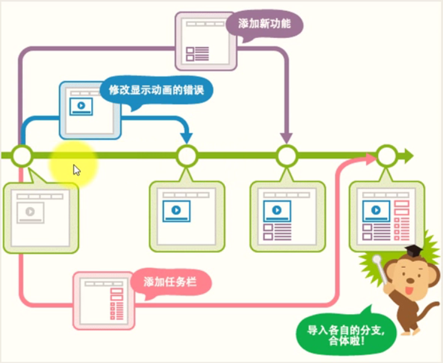  
         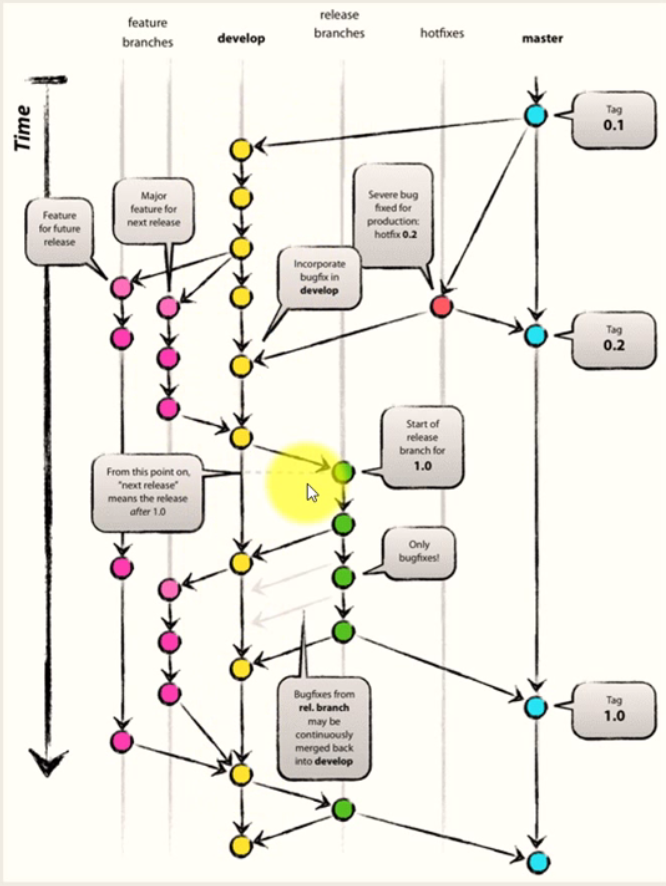  

         + 分支的分类
            * 长期分支: master、develop  
               至始至终，始终存在的分支。
            * 临时分支: feature branches、release branches、hotfixes

      + ### 实例演示分支操作
         * init   
         初始状态：只有一个master分支，在master分支上有三个提交。   
            
         * `git branch iss53`   
         第一步：创建一个iss53分支   
         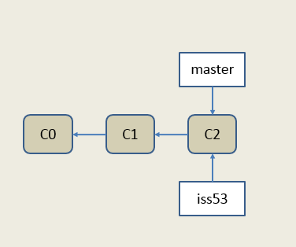  
         * `git checkout iss53` , `git commit -am 'C3'`   
         第二步：切换分支到iss53，并且提交一个版本C3   
         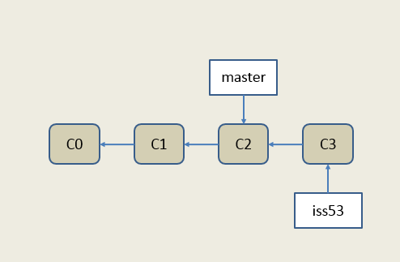  
         * `git checkout master`,`git branch hotfix`,`git checkout hotfix`,`git commit -am 'C4'`    
         第三步：切换分支到master(C2位置),再开一个hotfix分支,转换分支到hotfix，
         提交C4版本到hotfix   
            
         * `git checkout master`,`git merge hotfix`  
         第四步：把hotfix分支合并到master分支上(把分支A合并到分支B，操作要在分支B上进行)。  
         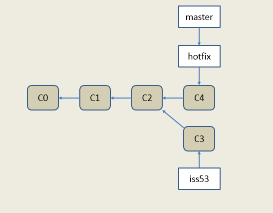  
         * `git branch -d hotfix`,`git commit iss53`,`git commit -am 'c5'`  
         第五步：删除hotfix分支,在iss53分支上提交一个版本C5。  
         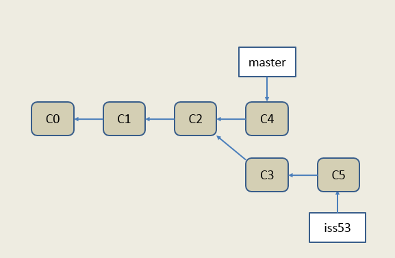  
         * `git checkout master`,`git merge iss53`  
         第六步：合并iss53分支到master分支上  
         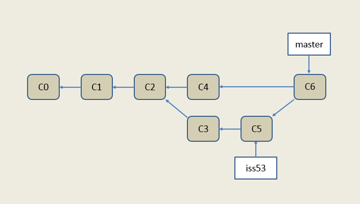 
      + ### 冲突解决
         * 冲突要点
            - 在不同分支上，修改同一个文件
            - 不同的人，修改了同一个文件
            - 不同的仓库，修改了同一个文件
            - 冲突只在合并分支的时候才会发生
            - 发生冲突并不可怕，冲突的代码不会丢失
            - 解决冲突，重新提交，commit时不要给message
            - 冲突信息格式
         * 冲突的标识  
            当merge发生冲突时，会导致merge失败。此时，编辑产生的冲突的文件，会发生在产生冲突的地方有冲突明显的标识(上边界 >>>>>> branchName、分割 =====、下边界 >>>>>>> branchName)；此时修改该部分，留下想要留下的内容，重新提交。但是不要提交message了。
      + ### 分支命令
         * `git branch <branch name>`  
            创建分支
         * `git checkout <branch name>`  
            切换分支
         * `git checkout -b <branch name>`  
            创建分支并切换到branch中
         * `git branch -m old_name new_name`    
            修改分支名字
         * `git branch -d <branch name>`  
            删除分支
         * `git branch -r`  
            列出远程分支
         * `git branch --merged`  
            查看已合并的分支 
         * `git branch --no-merged`  
            查看没有合并的分支 
         * `git checkout -t origin/<branch name>`   
            取出远程分支
         * `git push origin <space>:<remote branch>` \ `git fetch -p`  
            删除远程分支
         * `git merge <branch name>`  
            合并分支
         * `git merge --no-ff`  
            合并分支，拒绝fast forward，产生合并commit
         * `git stash`  
            保存进度,当不想提交工作区的内容,邮箱切换分支时，可以使用该命令将工作区的内容暂时保存起来，从而可以切换分支。 
         * `git stash pop`  
            弹出进度
         * `git stash list`  
            查看stash列表
         * `git stash clear`  
            删除stash列表

# 第三章 Git团队协作

   - ## 概述
      + [git工作流指南](https://github.com/xirong/my-git/blob/master/git-workflow-tutorial.md)
   - ## 集中式工作流
      + 工作方式  
         有一个中央仓库，开发者从中央仓库中push或者pull项目。然后各自开发，不用关注中央仓库中的版本情况。其工作流中只用到 `master` 这一个分支。  
         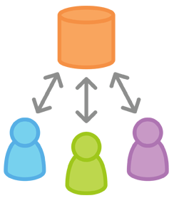  
         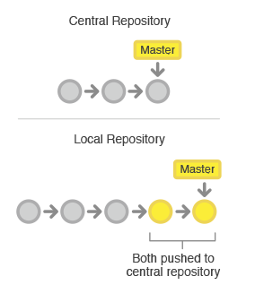
      + 冲突解决
         中央仓库代表了正式仓库，所有的提交应该被尊重且是稳定不变的。如果开发者本地的提交历史和中央仓库有分歧，Git会拒绝push提交，否则会覆盖在中央库的正式提交。  
         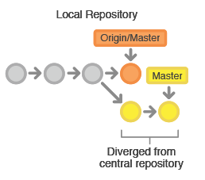  
         在开发者提交自己功能修改到中央库钱，需要先fetch在中央库的新增提交，rebase自己提交到中央库提交历史之上。这样的意思是 “我要把自己的修改加在别人已经完成的修改上面” 最终的结果是一个完美的线性历史。
      + 示例
         * 在github项目中邀请协作者  
            选择要合作的项目的  
            `setting` -> `Collaborators` -> `search user` -> `add` ;  
            邀请成功之后，该被邀请者就有向这个仓库 push 代码的权限了，否则他推不上来。
         * 项目开发者各自在自己本地 `clone` 仓库。
         * 开发过程中产生的矛盾
            1. 本地历史版本与中央历史版本不同
               + 开发者 A 向 中央仓库 push 一个版本；  
                     比如创建一个 a 文件，在其中输入 *aaaa*。
               + 开发者 B 向 中央仓库 push 一个版本；
                     比如创建一个 b 文件，在其中输入 *bbbb*。  
                     此时会发生冲突，中央仓库会拒绝提交改提交。其原因如下示意图：  
                       
                     其解决方法有两种：
                  1. `git pull`  
                        先把中央仓库的版本拽下来合并( 此时应该产生一个三方合并--merge ，此时的历史记录上会有一个第三方节点 )再push( `git push ` )。  
                        
                  2. `git pull --rebase`  
                        参数 `rebase` 是一个参数，不是命令；它可以避免产生三方合并,同时也更改了原本历史的hash值。合并后的的历史不会有三方节点，而是一个完整的线性，如下:  
                        
            2. 不同开发者(并行)修改了同一个文件(都是pull下了中央版本，在本地修改)
               + 开发者 A 修改了中央仓库的中的 a 文件中的第一行：在其后面增加了`-- A`
               + 开发者 B 修改了中央仓库的中的 a 文件中的第一行：在其后面增加了`-- B`
               + 开发者 A push 了修改的版本，并且成功。
               + 开发者 B push 了修改的版本，并且被拒绝，然后使用上述方法 `git pull --rebase`，来合并版本。此时 rebase 会出错。
               + 开发者 B 手动修复冲突， `vim a`，修改， `git add .`, `git rebase -- continue`;
   - ## 功能分支工作流  
      功能分支工作流以集中式工作流为基础，不同的是为各个新公共能分配一个专门的分支来开发。这样可以把新功能集成到正式项目前，用 `pull request` 的方式讨论变更。  
        

      + pull request  
         pull request 工作流能为每个分支发起一个讨论，在分支何如正式项目之前，给其他开发者表示赞同的机会。
         而有了pull request，协同开发时，一旦某个开发者完成一个功能，不是立即合并到 `master` 分支，而是 `push` 到中央仓库的功能分支上并发起一个 pull request 请求——将修改合并到 master 上。在修改成为主干代码之前，其他开发者有机会去 Review 变更。[pull request文档](https://confluence.atlassian.com/bitbucketserver/using-pull-requests-in-bitbucket-server-776639997.html)
      + 示例 ———— 前提环境和集中式一样，多个开发者，邀请开发者，clone仓库到本地 
         * 新开一个功能分支 ———— `git checkout -b feat-dialog`(直接切换到 feat-dialog分支上)  
         * 新建一个文件并做变更 ———— `touch c` , `echo ccc >> c`
         * 提交变更 ———— `git add .` , `git commit -am 'message'`
         * 继续变更提交；此时 `feat-dialog` 上有两个历史记录是 `master` 上没有的。
         * 将修改推到远程仓库上 ———— `git push origin feat-dialog`
         * 继续变更提交；
         * 再推到远程仓库上；修改推送的默认仓库使用
         `git push -u origin feat-dialog` 即 
         `git push --set-upstream origin feat-dialog`
         * 创建 pull request，在github仓库页面就可以按照提示创建。
         * 其他协作者就登录其自己的github页面就可以通过 pull request(简称 *PR*)导航来查看详情；点击进去，可以在 conversation 中交流；在 commits 查看提交记录；在 Files changed 查看提交详情并且做code review。    
         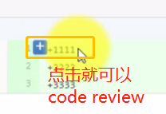  
         * 交流结束后修改代码，继续提交。
         * 再所有人同意后，可以再github中的PR里的conversation中来merge合并。  
           

   - ## Gitflow 工作流  
      Gitflow工作流与功能分支工作流几乎一样，只是Gitflow工作流比功能分支工作流多开了一些持久的分支，比如开发分支、发布分支、hotfix分支等等。工作示意图如下  
      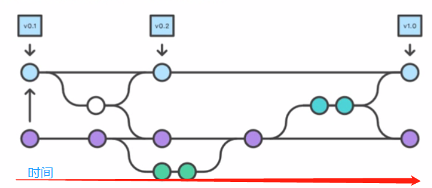  
         上图中
      + 紫色的为 **开发分支(Develop)**，是长期分支。一上来的开发都在该分支上。
      + 绿色的分支为 **功能分支(Feature)**，在需要做某些功能的时候开出，,完成后并入 **开发分支**。
      + 白色的是 **维护分支(hotfix)** 分支，用于bug修复，是从 **master分支**开出的，完成之后会并入 **master分支**和 **开发分支**
      + 青绿色的是 **发布分支(Release)**，用于发布。完成后也会并入 **master分支**和 **开发分支**
      + **master分支**上只放固定的版本如 1.0 , 2.0 等等。  
      
      从什么地方开出分支，就是在该地方下输入命名 `git branch branch_name`。

   - ## 集中式工作流、功能分支工作流、Gitflow工作流总结  
      
      这三个工作流都是基于集中式工作流，都是有一个中央仓库。不同的是他们分支逐渐增多，工作流也逐渐复杂。

   - ## Forking工作流
      + 简介  
      Forking工作流是有一个官方仓库，同时通过官方仓库可以fork出多个官方仓库的副本。
      这些官方仓库的副本存储在想要参与协同开发的开发者的仓库中。开发者就可以clone自己仓库的官方副本至本地，并进行修改。然后将修改本地仓库并push到自己远程仓库中，最后向官方仓库的开发者发送一个 `pull request` 请求，请求合并代码。官方仓库的开发者通过 `review code`可以查看修改并决定是否接受合并。其过程为：
         * `fork` 官方仓库
         * `clone` 自己仓库中的官方仓库副本至本地
         * 修改仓库中的代码
         * `push` 至自己的仓库中
         * 向官方仓库的开发者 `pull request`
         * 等待是否被接受合并  
      
      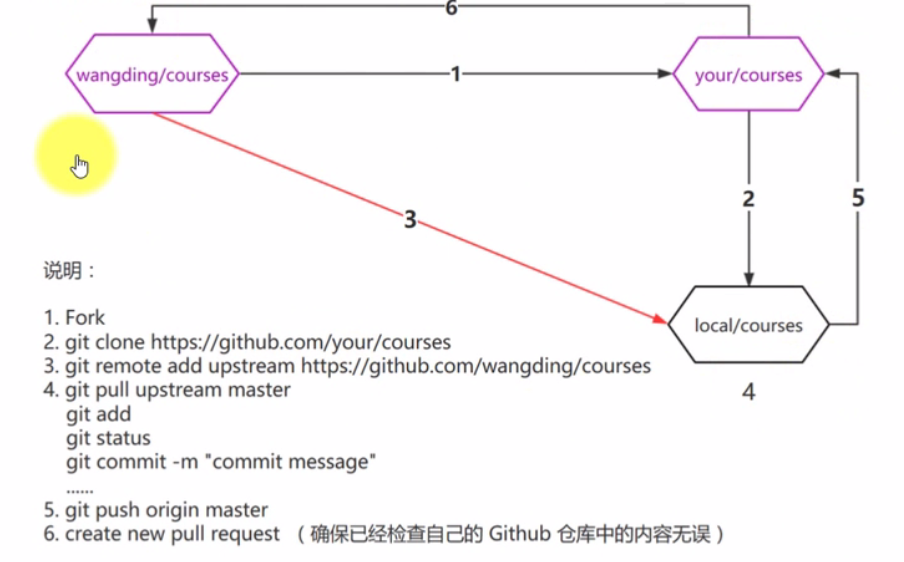  
      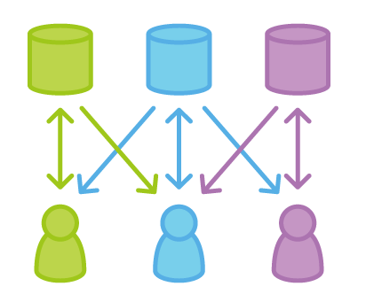  
      在这个过程中，存在一个问题，就是当将官方仓库fork至自己的仓库然后clone至本地时，如何保持与官方仓库的版本一致。这需要与官方仓库建立一个远程连接，使用命令 `git remote add <name> <url>`，然后在 `push` 之前先 `git pull <name> <branch name>` 官方仓库，以保证与官方仓库的同步。
      
   - ## Pull Request 总结
      + pull request 三大功能
         * 当一项项目被 watch 后，只要有人对该项目 pull request， watch 该项目的人就会收到通知。
         * pull request 提供会话的功能，和code review。
         * 可以 mergin 提交的代码
      + pull request 发生的四大要素
         1. 有发起方 —— source repository
         2. 发起方需创建功能分支 —— feature-source Branch
         3. 有接收方 —— destination repository
         4. 接收方的哪个分支接受该功能分支 —— Master-Destination Branch
      + 发生 pull request 的条件 
         上述中，*要素1*与 *要素3*，*要素2* 与 *要素4* 至少有一个不同
      + 最佳实践: [Git 使用规范流程](http://www.ruanyifeng.com/blog/2015/08/git-use-process.html?bsh_bid=701658724)


          
# 第四章 未完待续...


