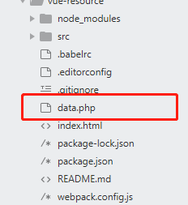
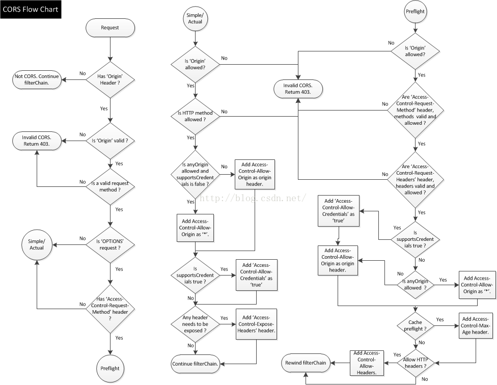

## 练习中发现的一些小细节
- 单页面模式
  - 在data中可以用this访问prop，但是在data中不可以用this访问其自身、computed、methods。
  - 自定义事件接收没有event对象
  - 在组件通信的过程中，子组件想要向父组件传递消息，可以有三种方法：  
     - 父组件给子组件传递一个回调函数
     - 子组件emit以个自定义事件(父组件在监听这个自定义事件时，只能绑定在子组件的html标签中)
     - 通过一个公共的Vue，也可称为服务--eventbus;
  - 在data中存储props的值，data属性不具备随着props中的值改变而变化值的功能，所以如果在data中存储值，只会接受第一次的值(应该是组件被创建之初的值很可能是“”，如果不通过methods赋值，直接在data中赋值)，如果后面随着事件props的值变换，data也不会变换。此时应该使用computed属性来保存或者返回该值。但是，如果props传递过来是一个对象，改变computed里的值也会影响原始值。
  
  ```html
  <template>
    <div>
      这个可改的,不会影响原来的元素,detail是以字符串传过来的：{{ detail === "" ? "wait" : detail }}
      <input type="text" v-model="detail">

      这个不可改的,会影响原来的元素：{{ detailObj.status }}
      <input type="text" v-model="detailObj.status">

      存在computed里的obj：{{ status.status }}
      <input type="text" v-model="status.status">

      <button @click="look">btn</button>
    </div>
  </template>
  <script>
  export default {
    props:['detail','detailObj'],
    data(){
      return {
        statuss:this.detailObj
      }
    },
    computed:{
      status(){
        return this.detailObj;
      }
    },
    methods:{
      look(){
        console.log(this.status);
      }
    }
  }
  </script>
  ```
  
  - 在vue中使用transition来实现动画，首先实现动画有三个要素：
    + 初始状态 
      在 *-enter 设置，一帧之后会被移除，目标状态就是本该显示的状态，也就是本来的样式。
    + 结束状态  
      直接在该element上添加样式,由于初始状态改变了element的样式，所以通过过度时间就可以实现动画。
    + 过度时间  
      在 *-enter-active 上设置。

  - 在vue中使用vue-resource请求不同源的php
    
    1.采取本地
    如果直接再目录中建立一个data.php文件用于返回请求，php得不到执行，会直接把php文件的所有内容返回。目录如下:  
      
    
    ```html
    <script>
    //vue中的代码
      this.$http.get("data.php",this.username)
        .then(response=>{
          console.log(response);
        },error=>{
          this.result = error
        })
    </script>
    ```
    ```php
    // data.php
    <?php 
      echo 123;
    ?>
    ```
    打印的结果：  
      
    从打印的结果看，访问php文件就好像是直接返回了文本，并没只有执行php代码。所以，我想是不是因为这么访问PHP文件，该文件没有经过php编译器进行编译。也可能是vue起的这个服务器没有php运行环境，是不是搭一个php环境就可以了？
    
    2.采取不同源
    ```html
    <script>
      //vue
        this.$http.get("http://localhost:8080/Testtt/vue/server.php？name=" + this.username)
        .then(response=>{
          console.log(response);
        },error=>{
          this.result = error
        })
    </script>
    ```

    ```php
      //php
      //指定可以访问的不同源的URL，使用“ * ”的话即随意什么URL都可访问。这个设置只支持get方法。
      header("Access-Control-Allow-Origin: http://localhost:8082");
      echo 123;
    ```
  - 关于cors跨域请求
    + 名词解释
      * 沙盒
         在计算机领域指一种虚拟技术，且多用于计算机安全技术。其原理是通过重定向技术，把程序生成的修改的文件定向到自身文件夹中。  
         沙盒是在受限的安全环境中运行应用程序的一种做法，这种做法是要限制授予应用程序的代码访问权限。  
         沙盒技术提供对资源的严格控制，沙盒通过限制对内存、系统文件和设置的访问，可以让企业可通过执行潜在的而已代码而发现其活动和意图。

    CORS(Cross-Origin Resource Sharing) 是一份浏览器技术的规范，提供了 Web 服务从不同网域传来 *沙盒脚本* 的方法，以避免浏览器的同源策略，是JSONP模式的现代版。  
    

    CORS请求流程：  
    
    
    <hr>
    
    + [跨域资源共享 CORS 详解 —— 阮一峰](http://www.ruanyifeng.com/blog/2016/04/cors.html)
    + [HTTP访问控制（CORS）—— MDN](https://developer.mozilla.org/zh-CN/docs/Web/HTTP/Access_control_CORS)
    
    <hr>
    
    + [cors跨域之简单请求与预检请求](https://segmentfault.com/a/1190000009971254)
    + [四种常见的 POST 提交数据方式 ](http://zccst.iteye.com/blog/2180127)
    + [CORS 跨域 access-control-allow-headers 的问题](https://blog.csdn.net/badboyer/article/details/51261083)
    + [CORS简介](https://www.cnblogs.com/loveis715/p/4592246.html)
    + [CORS（跨域）请求总结和测试](http://www.php.cn/js-tutorial-370087.html)  
    

  - [vue-resource示例](https://www.cnblogs.com/chenhuichao/p/8308993.html)   
  
