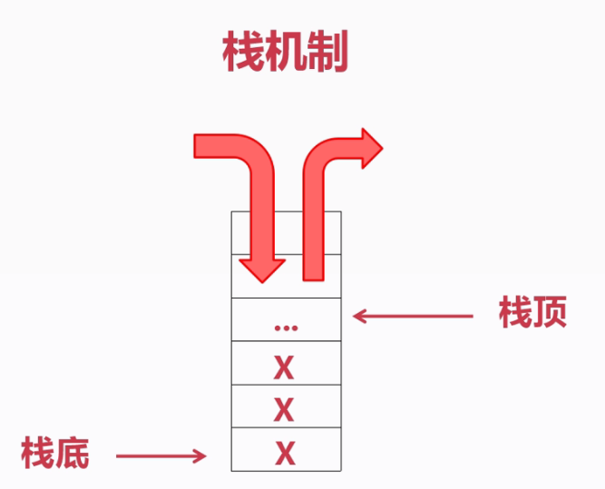
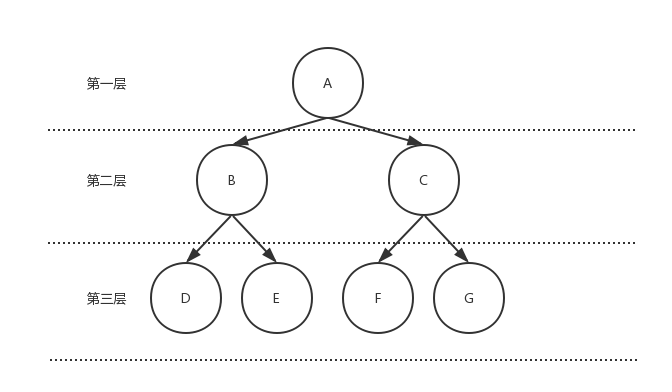
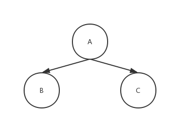
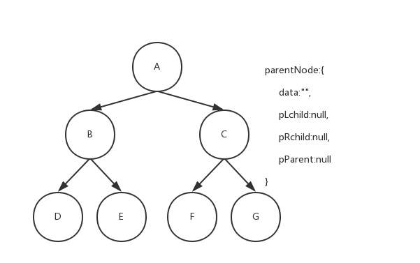

## 字符编码
- 多字节字符集 -- 中文: 多个字节
- unicode字符集 -- 中文: 2个字节

---

- ## 线性表链表篇
    + 线性表概念与原理
        * 线性表的定义
            - 存在唯一的一个被称作 “第一个” 的元素
            - 存在惟一的一个被称作 “最后一个” 的元素
            - 除第一个之外，集合中的每个元素均只有一个前驱
            - 除最后一个之外，集合中的每个元素均只有一个后继  
            其意思就是除了第一个和最后一个元素外，表中的每个元素都是前面只有一个元素，后面只有一个元素。并且只有一个开始元素，只有一个结束元素。
        * 简单线性表的存在形式
            - 数组 `[3,5,4,2,6,4]`  
              在计算机中，数组就是按照地址的顺序排布的( 00x1,00x2,00x3 ...)，
            - 比数组更近一步的是在 *数组的内容中放它的后继的地址*  
                   
                |2|5|4|-1|1|3|
                | --- | --- |--- | --- | --- | --- |
                |0|1|2|3|4|5|
                
            - 结构单元，前面一个元素代表自身的编号，后面一个元素代表他后继的编号(单链表)
            
                |1|3|
                | --- | --- |
                
                |2|4|
                | --- | --- |
                
                |3|2|
                | --- | --- |
                
                |4|0|
                | --- | --- |
                
            - 线性表的操作
                + 线性表初始化
                + 线性表遍历
                + 线性表插入元素
                + 线性表删除元素
            - 线性表的实现
                + [顺序表](sequence_list.html)
                    * 创建线性表
                    * 销毁线性表
                    * 清空线性表
                    * 判断线性表是否为空
                    * 获取线性表的长度
                    * 获取指定元素
                    * 寻找第一个满足e的数据元素的位序
                    * 获取指定元素的前驱
                    * 获取指定元素的后继
                    * 在第i各个位置插入元素
                    * 删除第i个位置的元素
                    * 遍历线性表
                
- ## 队列篇
    + 队列的实现原理
        * 原则: 先进先出 (first in first out) FIFO
        * 要素: 队列头，队列尾
        * 队列的变化: 当队列变化的时候，如果是指针不动，元素动的话，当队列头移除时，整个队列的元素都要向前移动一位，效率低下；如果是指针动，元素不动，则当队列头移除的时候，只需要移动一下指针即可。   
        
        * 类型: 普通队列，环形队列
            如果使用指针移动，在普通队列中前面被移除的内存在被移除的时候依然是被占用的，不能得到二次利用。如果用环形队列就可以解决这个问题。  
            
        * 队列的实现方式([环形队列](circle_queue.html))
            - 创建队列
            - 销毁队列
            - 清空队列
            - 判断队列是否为空
            - 队列长度
            - 新元素入队
            - 首元素出队
            - 遍历队列

- ## 栈篇
    + 栈的实现原理
        * 原则: 先进后出 (first in last out) FILO
        * 要素: 栈顶，栈底
        * 易混淆概念: 栈不等于堆，栈是一种数据结构，堆是另外一种数据结构  
        * 栈的机制示意图  
            
        * 栈的实现
            - 创建栈( 分配空间，设定栈容量，栈顶)
            - 判断栈是否为空
            - 判断栈是否已满
            - 清空栈
            - 栈中已有元素的个数
            - 入栈，栈顶上升
            - 出栈，栈顶下降
            - 遍历栈中所有元素
- ## 树篇
    + 树的基本概念  
    
        - 孩子(B,C,D,E,F,G)
        - 双亲/父节点(A,B,C)
        - 度: 一个节点的直接孩子(A->(B,C),B->(D,E)...)
        - 叶子(终端节点): 度为0的节点(D,E,F,G)
        - 根(非终端节点): 度不为0的节点(A,B,C)
        - 有序数: 结点之间不可以随意调换顺序
        - 无序数: 结点之间可以随意调换顺序
        - 深度: 层
        - 结点深度: 该结点自上而下是第几层就是该结点的深度(B的结点深度为2，D的结点深度为3)
        - 树的深度: 结点的最大深度(树的深度为3)
        - 森林: 不交叉的两个树就可以形成森林
    + 二叉树
        * 要求
            - 所有结点的度都小于等于2
            - 有序树
        * 性质  
            - 在二叉树的第i层上最多有(2^i-1)个结点
            - 深度为k的二叉树，最多有((2^k)-1)个结点
            - 如果终端节点数为n，度为2的结点数为m，则n=m+1
            - 具有n个结点的二叉树的深度为(int)(log2(n))+1
        * 遍历方式  
        
            - 二叉树的前序遍历:根左右(A->B->C)
            - 二叉树的中序遍历:左根右(B->A->C)
            - 二叉树的后序遍历:左右根(B->C->A)
        * 满二叉树 所有结点的度都等于2
        * 完全二叉树 从满二叉树从提取一部分的树  
            
            - 定义  对于深度为K的，有n个结点的二叉树，当且仅当其每一个结点都与深度为K的满二叉树中编号(编号是有固定顺序的，就是从上到下，从左到右依次分配)从1至n的结点————对应时称之为完全二叉树
        * 二叉树的存储结构
            - 顺序存储结构  
            
            - 链式存储结构
            
        * 二叉树的实现
            - 树的创建和销毁
            - 树中结点的搜索
            - 树中结点的添加与删除
            - 树中结点的遍历

