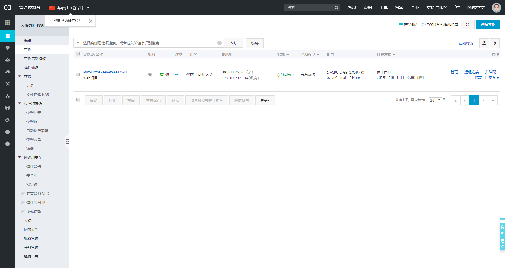
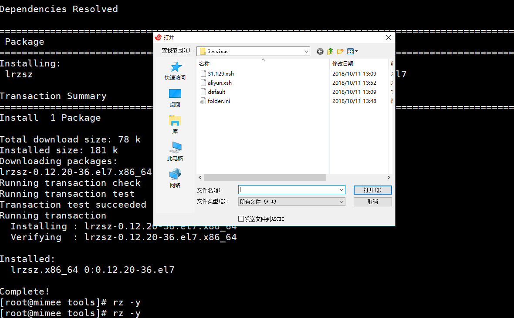

- # 连接
    + ## 购买阿里云
    + ## 打开购买阿里云的实例  
    
    + 在 [更多] 里可以设置远程连接密码，和用户登陆密码
    
    + 重启实例( 设置完后一定要重启，否则不会生效 )
    + 然后就可以远程连接了。

- # 向服务器中拷贝文件
    + ## 连接完成后如下图   
    
    + ## 创建一个目录来存储文件  
        `mikdir /home/mimee/tools -p`, 在该目录下创建 tools 文件夹。
    + ## 安装 rz 命令，该命令用于可以在window系统下向linux系统移动文件  
        `yum install lrzsz -y`
    + ## 安装完成后，使用 `rz -y` 就可上传文件了。  
        

- # 上传文件( 都是linux文件，以 tar.gz 为后缀名)
    + libiconv 
    + libmcrypt
    + mcrypt
    + mhash
    + mysql
    + nginx
    + php

- # 安装 nginx 之前需要两个基础包( pcre, opens )
    + 安装 pcre `yum install pcre pcre-devel -y`
    + 安装 opens `yum install openssl openssl-devel -y`
    + 创建一个 Nginx 账户来管理 Nginx；
        * `useradd nginx -s /sbin/nologin -M` 创建账号
        * `tail -l /etc/passwd` 查看账号是否创建
    + 解压 Nginx
        * `tar xf filename`
        * `cd filename`
    + 编译型的文件按照 *配置--编译--编译安装* 来处理
        * 配置信息，可以使用 `./configure --help` 查看更加详尽的配置命令
            ```
                ./configure --user=nginx 
                            <!-- 刚刚添加的nginx账户来管理这个Nginx -->
                            --group=nginx 
                            <!-- 设定为nginx组 -->
                            --prefix=/application/nginx-1.6.3/
                            <!-- 安装路径  -->
                            --with-http_stub_status_module\
                            <!-- 安装信息模块，可以查看丢包率 -->
                            --with-http_ssl_module
            ```
        * 执行 `make` 命令
        * 执行 `make install` 命令 ————安装拷贝文件
        * 创建一个软链接，便于管理 `ln -s /application/nginx-1.6.3/ /application/niginx`
    + 启动 nginx 服务
        * `/application/nginx/sbin/nginx -t`  
            `-t` 检查 Nginx 的配置语法
        * `/application/nginx/sbin/nginx` 启动
    + 确定是否启动(查看进程)
        * ` ps -ef | grep nginx`

- 域名绑定
    

